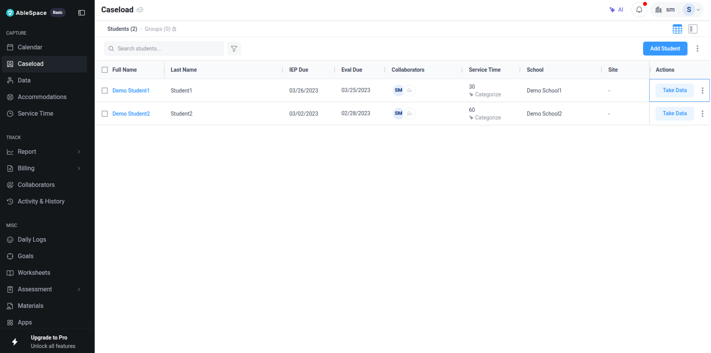
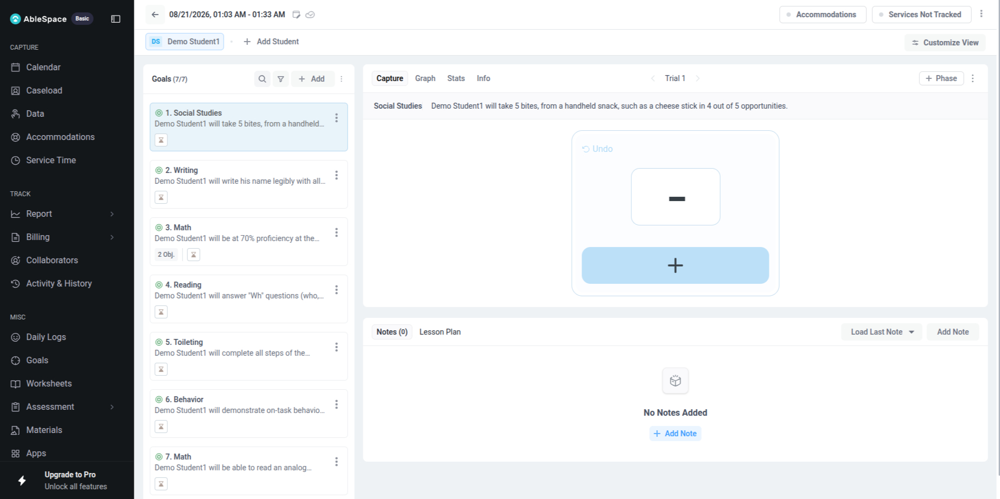
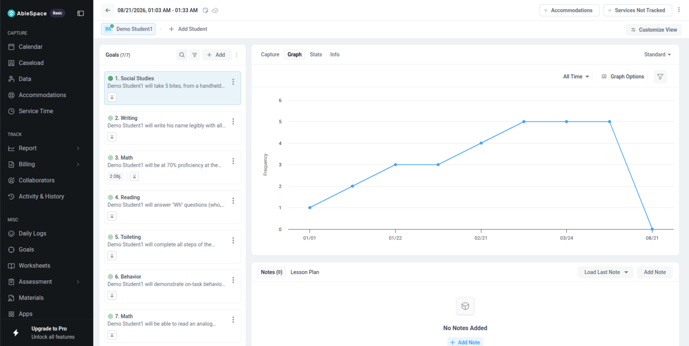
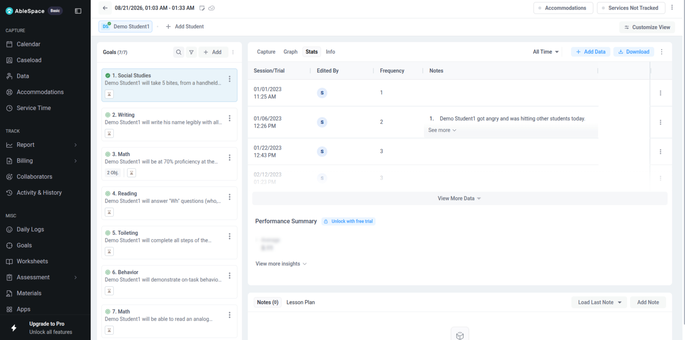
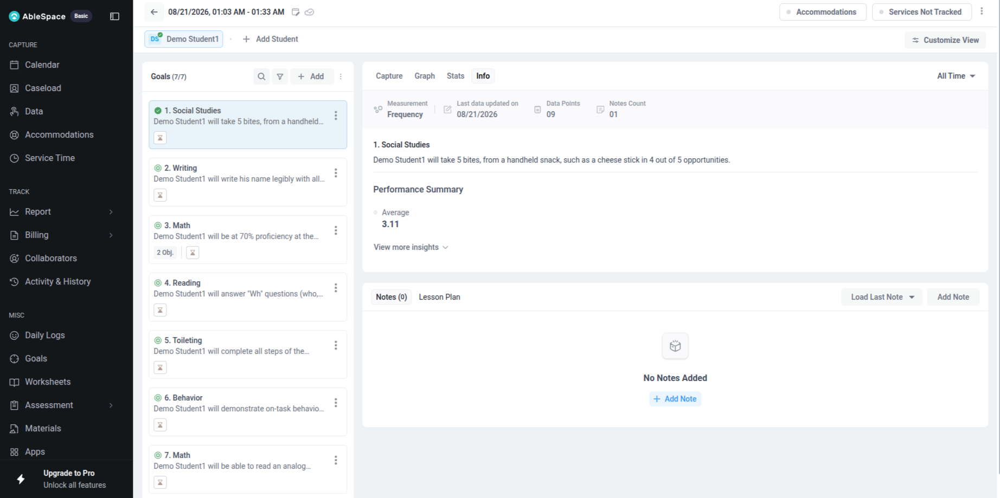

# Part 2 Documentation: AbleSpace Take Data Screen

## 1. Assessment Context

Part 2 of the AbleSpace Task Management assessment focuses on understanding the existing AbleSpace product, specifically the **Caseload → Take Data** workflow.

The objective of this exploration was to understand how a special education professional can select a student, record IEP goal data, review collected data, and access related statistics and insights.

The workflow was explored using an AbleSpace demo account with sample student data.

---

## 2. Product Context

AbleSpace is a platform designed for special education professionals to manage caseloads, track IEP goals, collect progress-monitoring data, manage service information, and review student performance.

For this assessment, the focus was specifically on the **Take Data** functionality available from the Caseload section.

---

## 3. Navigation to Take Data

The observed navigation flow is:

```text
Caseload
   ↓
Students
   ↓
Select Student
   ↓
Take Data
   ↓
Select Goal
   ↓
Capture Data
```

The Caseload screen provides a list of students and exposes a dedicated **Take Data** action for each student.

### Caseload Screen

The Caseload page displayed two demo students. Each student row provides actions including the ability to start the Take Data workflow.



---

## 4. Take Data Screen Overview

After selecting **Take Data** for a student, the system opens the goal data collection interface.

The screen provides:

* Student identification
* A list of available IEP goals
* Goal selection
* Capture interface
* Trial navigation
* Notes
* Lesson Plan section
* Accommodations
* Services Not Tracked
* View customization
* Graph
* Stats
* Info

The explored demo student had **7 available goals**.

Example goal categories visible during exploration included Social Studies, Writing, Math, Reading, Toileting, and Behavior.



---

## 5. Data Capture Workflow

The **Capture** tab is the primary area for recording goal data.

During exploration, the initial capture state displayed an empty value represented by `—`.

The `+` control was then used to record data.

Observed interaction:

```text
Initial state: —
        ↓
First + click: 0
        ↓
Second + click: 1
        ↓
Undo: 0
```

This demonstrated that the interface provides an interactive mechanism for recording and correcting the captured value.


### Observed Interaction

The presence of the **Undo** action is particularly useful because it allows the user to correct the most recent data entry without restarting the workflow.

The capture interface also provides trial navigation, allowing the user to work with individual trial records.

---

## 6. Graph View

The **Graph** tab provides a visual representation of collected data.

During exploration, the graph displayed:

* Historical data points
* Date-based progression
* Frequency on the Y-axis
* An All Time filter
* Graph options
* Filtering controls

This view allows a user to move from individual data entry to a visual understanding of performance over time.



### UX Observation

The graph is useful for progress monitoring because it converts individual data records into a visual trend. This can make changes in student performance easier to identify than reviewing raw values alone.

---

## 7. Stats View

The **Stats** tab provides a more detailed view of recorded data.

The observed interface included information such as:

* Session/trial information
* User who edited the record
* Frequency
* Notes
* Date and time
* Additional data records
* View More Data
* Add Data
* Download functionality



### UX Observation

The Stats view is useful for users who need to inspect individual records rather than only viewing an overall trend.

The availability of **Download** also provides a practical way to work with collected information outside the immediate interface.

---

## 8. Info View

The **Info** tab provides a higher-level summary of the selected goal.

The observed information included:

* Measurement type
* Last data update
* Number of data points
* Notes count
* Goal description
* Performance summary
* Average performance
* Additional insights

During the exploration, the screen displayed information such as **9 data points**, **1 note**, and an average value for the selected goal.



### UX Observation

The Info view works as a quick summary layer. Instead of requiring the user to inspect individual records, it presents important goal-level information in one place.

---

## 9. Overall Observed Workflow

Based on the exploration, the complete workflow can be summarized as:

```text
Caseload
   ↓
Select Student
   ↓
Take Data
   ↓
Select IEP Goal
   ↓
Capture Data
   ↓
Record Trial / Frequency
   ↓
Correct Data if Required
   ↓
Review Data
   ├── Graph
   ├── Stats
   └── Info
   ↓
Review Notes / Additional Information
```

The workflow separates **data collection**, **historical visualization**, **detailed statistics**, and **goal-level insights**, which provides different levels of information depending on the user's needs.

---

# 10. UX/UI Analysis

## Strengths

### Clear student-level entry point

Providing a dedicated **Take Data** action for each student makes it straightforward to start data collection from the Caseload.

### Goal-based organization

Displaying goals in a dedicated sidebar makes it possible to switch between different IEP goals without leaving the data collection workflow.

### Multiple information views

Separating the interface into **Capture, Graph, Stats, and Info** provides different ways to interact with and understand collected data.

### Immediate data correction

The Undo functionality provides a convenient way to correct an accidental capture.

### Contextual information

Notes, lesson plans, accommodations, and service-related information are available alongside the goal tracking workflow.

### Data visualization

The Graph view provides a visual representation of historical performance, which can be more useful for progress monitoring than raw numbers alone.

---

# 11. UX/UI Improvement Opportunities

The following improvements could make the workflow more efficient and accessible.

## 11.1 Stronger selected-goal indication

When multiple goals are available, the currently selected goal could have an even stronger visual indicator.

**Improvement:**

* Stronger selected-state styling
* Clear goal title near the capture area
* Optional breadcrumb such as `Student → Goal → Trial`

This would reduce the possibility of recording data against the wrong goal.

---

## 11.2 Clearer capture feedback

The numeric capture interaction is simple, but stronger feedback could improve confidence.

**Improvement:**

After recording data, provide a subtle confirmation such as:

> Data recorded successfully

This would make the system state clearer, especially for new users.

---

## 11.3 Improved trial navigation

Trial-based workflows can become difficult to follow when many trials are involved.

**Improvement:**

A compact trial indicator could show:

```text
Trial 1 of 10
```

along with clearer previous/next controls.

---

## 11.4 Better empty-state guidance

The initial `—` state provides limited explanation of what the user should do.

**Improvement:**

Provide a short contextual hint such as:

> Use + to record the first observation.

This would improve discoverability for new users.

---

## 11.5 Responsive layout optimization

Because data collection may be performed on tablets or mobile devices, the interface should maintain comfortable touch targets and readable content at smaller screen sizes.

**Improvement:**

* Larger touch targets
* Sticky Capture controls
* Better collapsing behavior for the goal list
* Reduced horizontal scrolling
* Mobile-friendly Graph and Stats layouts

---

## 11.6 Accessibility improvements

The data collection workflow could be further strengthened through accessibility-focused interaction design.

Potential improvements include:

* Clear keyboard focus states
* Descriptive labels for icon-only controls
* Screen-reader-friendly button labels
* Sufficient contrast
* Accessible graph descriptions
* Keyboard support for data capture actions

---

# 12. Functional Improvement Opportunities

## 12.1 Better save-state feedback

The interface could clearly communicate whether captured data has been saved successfully.

Possible states:

```text
Saving...
Saved
Unable to save — Retry
```

This would reduce uncertainty during data collection.

---

## 12.2 Confirmation before leaving unsaved data

If a user has entered data but navigates away before the information is saved, the system could display a warning.

Example:

> You have unsaved data. Leave this page?

This would help prevent accidental data loss.

---

## 12.3 Goal search/filtering

For users with larger caseloads or many goals, searching or filtering goals could make navigation faster.

Potential options:

* Search by goal name
* Filter by goal category
* Recently used goals
* Frequently used goals

---

## 12.4 Enhanced data-entry shortcuts

For repetitive data collection, keyboard shortcuts or configurable quick-entry actions could reduce the number of interactions required.

This would be particularly useful for professionals recording data across multiple students or trials.

---

## 12.5 Improved no-data states

Graph, Stats, and Info views should clearly explain when there is insufficient historical data.

For example:

> No historical data is available for this goal yet. Record data to begin tracking progress.

This provides clearer guidance than showing an empty visualization.

---

# 13. Functional Design Observations

The explored workflow demonstrates a separation between three major user needs:

### Data Collection

The **Capture** view is optimized for recording current observations.

### Data Review

The **Stats** view provides detailed records and supporting information.

### Progress Understanding

The **Graph** and **Info** views provide visual and summarized insights.

This separation is useful because different tasks require different levels of detail.

---

# 14. Overall Assessment

The Take Data workflow provides a focused path from student selection to goal-level data collection and subsequent progress review.

The strongest aspects observed during exploration were:

* Direct access from the Caseload
* Goal-based organization
* Simple data capture controls
* Undo support
* Historical graph visualization
* Detailed statistics
* Goal-level summary information
* Notes and contextual information

The main opportunities for improvement are around **feedback, discoverability, accessibility, responsive behavior, trial navigation, and protection against accidental data loss**.

---

# 15. Evidence / Screenshots

The following screenshots were captured during the exploration of the AbleSpace demo environment:

| # | Screenshot                 | Purpose                                          |
| - | -------------------------- | ------------------------------------------------ |
| 1 | `01-caseload.png`          | Caseload and student-level Take Data entry point |
| 2 | `02-take-data-initial.png` | Initial Take Data / Capture state                |
| 3 | `03-take-data-capture.png` | Data capture interaction                         |
| 4 | `04-graph.png`             | Historical graph and visualization               |
| 5 | `05-stats.png`             | Detailed statistical/data records                |
| 6 | `06-info.png`              | Goal summary and performance insights            |

All screenshots are stored under:

```text
docs/part2/
```

---

# 16. Conclusion

The AbleSpace Caseload → Take Data workflow was explored using a demo account with sample student data.

The exploration covered the complete path from selecting a student and goal to recording data and reviewing the resulting information through Capture, Graph, Stats, and Info views.

The workflow demonstrates a product approach centered around quick data collection followed by structured progress monitoring. The identified UX/UI and functional improvements focus primarily on making the workflow more transparent, accessible, responsive, and resilient against user errors.

**Part 2 Status: Completed**

**Evidence:** Six screenshots documenting the explored workflow are included in `docs/part2/`.
